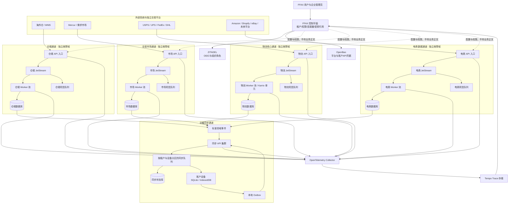

# FFAX 多通道 API、设备同步与统一控制平面架构报告

- 架构编号：`multi-channel-runtime`
- 版本：`1.0.0`
- 负责人：FFAX Platform
- 实施状态：主线源码已接入，尚未执行生产构建、数据迁移和正式切换
- 报告生成时间：2026-08-17T10:10:46.058Z
- 架构指纹：`d9c0d931f9d8afb0175fba1afadf6a6360e6f9a2fe35bc83c32f8bf2dbe010a3`
- 纳入指纹的源码文件：111 个

> 本报告由主线强制脚本生成。源码架构发生变化后，旧报告会立即失效；未更新报告时，主线构建和正式部署会停止。

## 功能定位

本架构把仓储、交易市场、物流和电商拆分为四条互不阻塞的业务通道。FFAX 控制平面只管理租户、权限、连接器元数据、密钥引用和运行状态，不承载订单、轨迹、库存等业务流量。每条通道拥有独立入口、消息缓冲、消费者、死信处理和数据边界；设备同步通过单独通道向每个租户和设备提供增量数据，避免任何一家外部平台或客户设备故障拖垮整套系统。

### 本次目标

- 消除单一总线、单一 Worker 或单一数据库造成的全局堵塞风险。
- 让 USPS、UPS、FedEx、DHL 等物流连接器拥有专用处理链路和可追踪故障节点。
- 让 Amazon、Shopify、eBay 等电商连接器按供应商独立限流、重试和扩容。
- 保持 Mercur 交易市场独立，避免市场订单与外部电商订单共享故障域。
- 为客户提供可选择的 API 连接器，并把属于该租户的数据增量同步到本地设备。
- 通过统一 Trace ID 串联网关、消息、Worker、数据库和设备同步，快速定位具体故障节点。

## 详细功能介绍

### 1. FFAX 控制平面

集中管理企业租户、角色权限、连接器启停、连接器配置版本、密钥引用、通道路由和运行状态。控制平面不转发业务数据，因此即使控制台临时不可用，已经运行的业务通道仍可继续消费队列。

- 处理数据：租户、用户角色、连接器元数据、配置版本、密钥引用、通道健康状态和 Trace 查询索引。
- 安全边界：ZITADEL Token 决定用户、租户和角色；客户端提交的 tenantId 不作为可信身份；真实秘密保存在 OpenBao。
- 当前状态：控制平面 API、连接器管理接口和拓扑查询接口已接入主线。

### 2. 仓储与 WMS 通道

接收海外仓、WMS、库存和出入库事件，在仓储专属 JetStream 中缓冲，再由仓储 Worker 池转换、校验和持久化。仓储流量不会占用物流、电商或交易市场的消费者。

- 处理数据：仓库、库位、库存快照、入库单、出库单、调拨单和库存变更事件。
- 安全边界：每个连接器使用独立凭据引用、签名策略、租户映射和速率限制。
- 当前状态：通道骨架、队列、Worker、死信路径和数据库边界已接入；具体 WMS 适配器待逐家实现。

### 3. 交易市场通道

Mercur、需求市场、报价、还价、交易订单和插件授权走独立市场通道。市场状态变化先形成领域事件，再驱动通知、授权和设备同步，不直接依赖电商或物流通道在线。

- 处理数据：供应商、商品或服务、需求、报价、订单、履约状态、退款状态、评价和插件权益。
- 安全边界：Mercur 与 FFAX 身份通过 ZITADEL OIDC 映射；市场数据库不与 ZITADEL 身份数据库混用。
- 当前状态：独立通道运行骨架已接入；完整 Mercur 业务模型和结算闭环仍需继续接入。

### 4. 物流核心通道

USPS、UPS、FedEx、DHL 以及未来承运商 API 进入物流专属入口。统一标准模型覆盖运价、标签、提货、取消、轨迹和异常，同时按承运商设置独立并发、熔断、重试和死信策略。

- 处理数据：包裹、运价、标签、追踪号、扫描节点、预计送达、异常、索赔和费用。
- 安全边界：客户可选择平台凭据或自有承运商凭据；凭据仅保存到 OpenBao，业务库只保存引用 ID。
- 当前状态：物流隔离通道、Karrio 单元配置和可观测链路已接入；生产承运商账户与逐家签名适配待配置。

### 5. 电商数据通道

Amazon、Shopify、eBay 等电商 Webhook 和拉取任务进入电商专属队列。不同平台按连接器分区消费，大促流量可积压在本通道，不会占满物流和仓储资源。

- 处理数据：店铺、商品、库存映射、订单、退款、客户、履约回写和 Webhook 原始事件。
- 安全边界：按平台验证签名和时间戳；租户与店铺绑定由服务端配置决定；原始请求设置保留期限并脱敏。
- 当前状态：电商通道骨架已接入；各平台官方签名校验、增量游标和限流适配器待实现。

### 6. 设备同步通道

云端业务事件先写入按租户分区的同步队列，设备用游标拉取增量，再写入 SQLite 或 IndexedDB。设备离线不会阻塞上游；恢复联网后从最后确认点续传。设备修改通过 Outbox 上传，并用版本号和幂等键解决重复与冲突。

- 处理数据：设备注册、同步游标、增量变更、确认点、Outbox 操作、版本号和冲突记录。
- 安全边界：设备必须属于当前 ZITADEL 用户和租户；同步查询由服务端注入租户范围；支持设备撤销。
- 当前状态：设备注册、增量拉取、检查点和 Outbox API 已接入；客户端 SQLite/IndexedDB 适配器待接入模板。

### 7. 密钥管理与租户隔离

OpenBao 保存外部平台凭据、Webhook 密钥和服务身份。FFAX 数据库只记录不可逆的引用与版本，Worker 按最小权限短时读取所需秘密。

- 处理数据：秘密路径引用、版本、轮换状态、访问策略和审计元数据。
- 安全边界：禁止秘密进入前端 VITE_ 变量、Git、报告、日志和普通业务表。
- 当前状态：OpenBao 容器、初始化脚本和应用读取路径已接入；自动轮换和生产审计告警待完成。

### 8. 端到端可观测与故障定位

入口创建或继承 Trace ID，并把它传入消息头、Worker 日志、数据库记录和设备同步事件。OpenTelemetry Collector 汇总遥测，Tempo 保存分布式 Trace，控制平面提供按 Trace ID 查询入口。

- 处理数据：Trace、Span、服务名、连接器 ID、租户匿名标识、消息序号、重试次数和错误类别。
- 安全边界：遥测不得记录正文、密码、Token、私钥或客户敏感字段；租户管理员只能查看本租户追踪。
- 当前状态：Collector、Tempo、上下文传播和查询 API 已接入；前端瀑布图、告警规则和采样策略待完善。

## 总体架构图

四个业务域各自形成独立入口、消息缓冲、Worker、死信和数据库边界。控制平面只下发配置与权限，不进入业务数据路径。所有业务域可以独立增加网关实例、JetStream 节点、Worker 和数据库副本。设备同步只消费已经持久化的领域事件，因此客户设备断网不会反向阻塞业务处理。

## API 清单

| 方法 | 路径 | 功能 | 鉴权 | 负责域 |
|---|---|---|---|---|
| GET | /api/v1/control-plane/topology | 返回业务通道、运行实例、健康状态和隔离关系。 | ZITADEL 平台管理员 | 控制平面 |
| GET | /api/v1/control-plane/connectors | 按当前租户列出连接器、启停状态、配置版本和健康摘要。 | ZITADEL 租户管理员 | 控制平面 |
| PUT | /api/v1/control-plane/connectors/:id | 更新非秘密连接器配置并递增配置版本。 | ZITADEL 租户管理员 | 控制平面 |
| PUT | /api/v1/control-plane/connectors/:id/credential | 把凭据写入 OpenBao，并仅保存秘密引用。 | ZITADEL 租户管理员 | 控制平面 |
| GET | /api/v1/control-plane/traces/:traceId | 查询一次请求跨网关、消息、Worker 和同步通道的完整 Trace。 | 平台管理员或所属租户管理员 | 可观测 |
| POST | /integration-api/:channel/v1/webhooks/:connectorId | 接收仓储、市场、物流或电商事件并进入对应独立通道。 | 连接器签名、时间戳、重放保护 | 四个业务域 |
| POST | /sync-api/v1/devices | 注册当前用户的同步设备并返回设备标识。 | ZITADEL 用户 | 设备同步 |
| GET | /sync-api/v1/changes | 按设备游标读取当前租户的增量变更。 | ZITADEL 用户与设备归属校验 | 设备同步 |
| PUT | /sync-api/v1/checkpoints/:channelId | 确认设备已落库的通道游标。 | ZITADEL 用户与设备归属校验 | 设备同步 |
| POST | /sync-api/v1/outbox | 提交离线期间产生的本地操作，使用幂等键和版本号处理。 | ZITADEL 用户与设备归属校验 | 设备同步 |
| GET | /sync-api/v1/outbox/:operationId | 查询本地操作的接收、处理、冲突或失败状态。 | ZITADEL 用户与租户隔离 | 设备同步 |

## 关键数据流

### 1. 物流 Webhook 到客户设备

1. 承运商请求进入物流 API 入口，验证连接器、签名、时间戳和幂等键。
2. 入口生成 Trace ID，把标准化前的事件写入物流 JetStream 后立即确认接收。
3. 物流 Worker 读取消息，通过对应承运商适配器转换为 FFAX 轨迹模型。
4. 写入物流数据库并发布 shipment.updated 标准领域事件。
5. 设备同步服务按租户分区写入同步队列；在线设备增量拉取，离线设备稍后续传。
6. 设备本地事务写入 SQLite 或 IndexedDB 后提交检查点，服务器推进该设备游标。

### 2. 电商大促订单削峰

1. 不同店铺的订单 Webhook 进入电商入口，并按租户、平台和店铺形成分区键。
2. 事件持久化到电商 JetStream；即使短时间超过 Worker 处理能力，也只在电商通道积压。
3. Worker 按平台限流并批量写入电商数据库，失败消息按退避策略重试。
4. 达到重试上限的消息进入电商死信队列，不影响仓储、市场和物流通道。
5. 运营人员使用 Trace ID 定位平台、连接器、消息序号、重试次数和失败节点。

### 3. 客户设备离线编辑与冲突处理

1. 设备把本地修改和基础版本写入本地 Outbox，不要求云端实时在线。
2. 网络恢复后提交 operationId、幂等键、实体版本和变更内容。
3. 同步 API 只接收当前用户和租户允许的实体，并把操作写入同步队列。
4. 目标业务域以版本号执行乐观并发控制；重复操作直接返回先前结果。
5. 版本冲突保留服务端版本与客户端意图，返回 conflict 状态供工作台处理。

### 4. 连接器凭据配置

1. 租户管理员在工作台选择平台和连接器，只提交到 FFAX 控制平面。
2. 控制平面校验角色和连接器归属，把秘密写入 OpenBao 的租户隔离路径。
3. 普通数据库只保存 credentialRef、版本和更新时间，不保存秘密正文。
4. 对应通道 Worker 以服务身份短时读取凭据，并在日志和 Trace 中保持脱敏。

## 故障隔离与排查边界

### 仓储与 WMS

- 隔离范围：仓储入口、仓储 JetStream、仓储 Worker、仓储死信和仓储数据库。
- 失败处理：暂停单个 WMS 连接器或扩容仓储 Worker；其他三条业务通道继续运行。
- 排查入口：Trace ID、warehouse stream consumer lag、连接器健康和仓储 DLQ。

### 交易市场

- 隔离范围：Mercur、需求市场、市场 JetStream、市场 Worker 和市场数据库。
- 失败处理：市场订单可独立重试或回滚，不占用外部电商和物流消费者。
- 排查入口：市场订单 ID、Trace ID、marketplace stream lag、Mercur 事件和市场 DLQ。

### 物流核心

- 隔离范围：物流入口、承运商适配器、物流 JetStream、Karrio 单元和物流数据库。
- 失败处理：按承运商熔断；USPS 故障不应停止 UPS、FedEx、DHL，更不应停止电商或市场。
- 排查入口：承运商、连接器 ID、追踪号哈希、Trace ID、重试状态、Karrio 日志和物流 DLQ。

### 电商数据

- 隔离范围：电商入口、平台适配器、电商 JetStream、电商 Worker 和电商数据库。
- 失败处理：按 Amazon、Shopify、eBay 及店铺粒度限流、暂停和重放。
- 排查入口：平台、店铺、Webhook ID、Trace ID、consumer lag 和电商 DLQ。

### 设备同步

- 隔离范围：同步 API、按租户和设备分区的队列、同步状态库及设备本地数据库。
- 失败处理：离线设备不阻塞业务通道；单设备冲突或损坏只冻结该设备游标。
- 排查入口：tenant、user、device、channel、cursor、operationId 和 conflict 状态。

### 控制平面与密钥

- 隔离范围：连接器配置、权限、密钥引用、OpenBao 和健康汇总。
- 失败处理：控制平面故障时禁止新配置变更；现有 Worker 使用受控缓存继续处理，缓存过期后安全停止对应连接器。
- 排查入口：配置版本、服务身份、OpenBao 审计、控制平面日志和 Trace 查询。

## 开源组件、版本与许可证边界

| 组件 | 固定版本 | 许可证 | 用途 | 使用边界 |
|---|---|---|---|---|
| Apache APISIX | 3.13.0 | Apache-2.0 | 分通道入口、路由、限流和认证前置。 | 生产需由单实例提升为多节点并接入独立配置存储。 |
| NATS JetStream | 2.11.11 | Apache-2.0 | 各业务通道的持久消息、重试、消费者和死信缓冲。 | 不同业务域使用独立 stream、consumer 和容量预算；生产需配置集群、副本与存储告警。 |
| OpenBao | 2.6.1 | MPL-2.0 | 平台及客户自有 API 凭据、服务身份和轮换策略。 | 业务库只保存引用；禁止把秘密传入浏览器、报告和日志。 |
| Karrio | 2026.1.32 | LGPL-3.0 core | 物流标准模型和多承运商适配单元。 | 只使用明确许可的开源核心；企业版多租户能力不视为已获得。 |
| OpenTelemetry Collector | 0.158.0 | Apache-2.0 | 统一采集 Trace 和服务遥测。 | 需要字段脱敏、租户隔离、采样和保留期限。 |
| Grafana Tempo | 3.0.3 | AGPL-3.0 | 分布式 Trace 存储和查询。 | 自托管部署，遵守许可证义务，不复制或闭源修改其源码。 |
| PostgreSQL | 16 | PostgreSQL License | 控制、业务域和同步状态的持久化数据库。 | 逻辑或物理隔离各业务域；不得与 ZITADEL 身份库混用。 |
| Redis | 7.4 | 按锁定镜像许可证复核 | 短期缓存、限流和非持久协作状态。 | 不作为订单、轨迹、库存或授权的唯一事实来源。 |
| Mercur | 稳定镜像由生产环境锁定 | MIT core | 交易市场、供应商、商品、订单和履约核心。 | 独立数据库和服务；通过标准事件与 FFAX 连接，不修改 ZITADEL 数据库。 |

## 本次已完成

- 建立 warehouse、marketplace、logistics、commerce 四个独立通道运行时。
- 为每条通道配置独立 JetStream、Worker 消费、重试和死信处理边界。
- 建立 FFAX 控制平面的拓扑、连接器、凭据引用和 Trace 查询 API。
- 接入 OpenBao 自托管秘密存储与初始化脚本。
- 接入物流 Karrio 独立单元配置，预留客户自有承运商账户。
- 建立设备注册、增量变更、检查点和 Outbox API。
- 接入 OpenTelemetry Collector 与 Tempo，并传播 Trace ID。
- 扩展生产 Docker Compose、Nginx 和原子部署脚本的服务边界与健康检查。
- 在工作台加入 API 集成控制台入口，显示通道与运行状态。

## 详细变更日志

### 服务端运行时

- 新增控制平面、通道运行时、消息发布/消费、死信和设备同步模块。
- 新增租户、用户、连接器、设备、Trace 和幂等上下文传播。
- 保持四个业务域分别监听和独立扩缩容。

### 基础设施

- 新增四通道 Docker Compose 服务定义。
- 新增 OpenBao 密钥服务、初始化脚本和应用策略目录。
- 新增 Karrio 物流单元配置。
- 新增 OpenTelemetry Collector 与 Tempo 配置。

### 前端工作台

- 新增统一 API 集成控制平面页面。
- 显示业务通道、连接器、运行状态与错误定位入口。
- 所有入口保持在 FFAX 工作台内部路由，不使用 iframe。

### 生产部署

- 原子部署脚本增加新容器启动、健康检查和回滚服务清单。
- Nginx 增加 control-plane、sync-api 和四通道 integration-api 入口。
- 本报告门禁加入主线构建和正式部署前置检查。

## 接下来必须完成

| 优先级 | 任务 | 负责人 | 前置/阻塞 | 验收标准 |
|---|---|---|---|---|
| P0 | 为 USPS、UPS、FedEx、DHL 建立生产开发者账户、Webhook 和客户自有凭据配置流程。 | 物流集成 | 承运商企业账户、合同权限和生产凭据。 | 四家承运商分别完成运价、标签、取消、追踪和异常的沙箱到生产验收。 |
| P0 | 逐个平台实现官方签名校验、重放保护、字段映射、速率限制和幂等处理。 | 连接器团队 | 各平台应用注册、测试店铺或承运商账号。 | 非法签名返回 401；重复事件不重复写入；平台限流不会波及其他连接器。 |
| P0 | 执行数据库迁移、生产构建、容器启动、健康检查和原子切换。 | 平台运维 | 当前指令未授权本轮构建、启动、测试和部署。 | 所有健康端点通过，旧版本可一键回滚，www.ffax.com 工作台主流程正常。 |
| P0 | 完成两企业租户的端到端隔离和越权测试。 | 安全与后端 | 需要第二个测试组织、用户和平台连接器。 | 需求、订单、轨迹、凭据引用、同步数据、Trace 和布局全部不可跨租户读取。 |
| P1 | 把每条通道从单实例运行骨架提升为多节点 APISIX、JetStream 副本和可水平扩容 Worker 池。 | 平台基础设施 | 生产节点数量、容量预算和持久卷规划。 | 任一网关或消息节点停止时对应通道继续服务，并且不会影响其他通道。 |
| P1 | 完善设备端 SQLite 与 IndexedDB 同步 SDK、冲突界面和数据保留策略。 | 工作台与同步 | 确定桌面端、移动端和浏览器端首批支持范围。 | 设备离线、断电、重复上传、双端同时修改和重新安装均有确定结果且不丢数据。 |
| P1 | 完成 Trace 瀑布图、通道积压、DLQ、数据库延迟和 OpenBao 审计告警。 | 可观测平台 | 生产保留期、采样率和告警接收渠道。 | 可从一条用户请求定位到具体平台、连接器、消息、Worker、数据库或设备节点。 |
| P1 | 完成 Mercur 供应商、需求、报价、订单、履约、退款、评价和插件授权闭环。 | 交易市场 | 支付 KYC、佣金和结算规则需要业务确认。 | 免费和内部授权可正式运行；真实扣款在生产支付密钥就绪后启用。 |
| P2 | 按同一通道模板扩展 10 至 20 个电商、物流和 WMS 连接器。 | 生态连接器 | 平台优先级、API 合同、客户需求和测试账户。 | 新增连接器只增加本域适配器和配置，不修改其他业务域核心逻辑。 |

## 安全与合规说明

- ZITADEL 是唯一人类身份源；Token 中的 sub、组织和角色由服务端解析。
- 客户端不得提交可信 tenantId；所有数据库查询由服务端租户上下文约束。
- 所有外部 API 密钥和 Webhook 秘密进入 OpenBao，不进入 VITE_ 变量、Git、报告或普通日志。
- Webhook 必须验证官方签名、时间戳、来源和幂等键，原始正文按最短必要期限保留。
- Trace 与指标不得包含邮件正文、地址、支付信息、Token、密码、私钥或完整客户敏感数据。
- OpenClassify 仅作为功能参考，不复制无许可证源码、迁移、样式或素材。

## 发布与回滚说明

- 生产发布前分别备份 ZITADEL、FFAX 平台、Mercur 和各业务域数据库。
- 新静态包和新容器先在 workspace.next 运行并通过健康检查，再切换 Nginx 和工作区。
- 任一健康检查、迁移、镜像构建或 Nginx 校验失败时恢复旧工作区、旧容器和旧配置。
- 首次上线默认关闭未完成官方签名适配或缺少生产凭据的连接器。
- 真实支付、承运商生产下单和外部店铺写回必须经过单独启用和审计。

## 报告门禁

- 生成命令：`npm run api:report -- docs/api-integrations/manifests/multi-channel-runtime.json`
- 校验命令：`npm run api:report:check`
- `npm run build` 会自动先执行报告校验。
- 正式部署脚本会在切换服务前再次校验架构指纹。
- 报告正文不得记录密码、Token、私钥、API Key 或客户端密钥。
