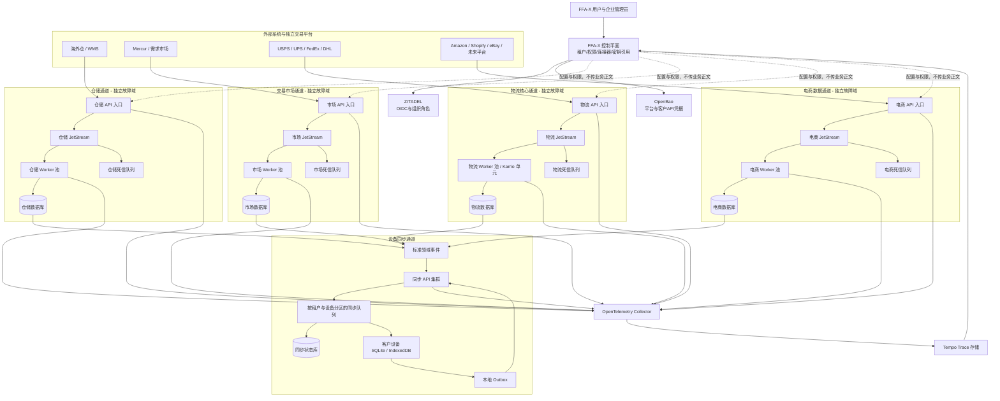

# FFA-X 多通道 API、设备同步与统一控制平面架构报告

- 架构编号：`multi-channel-runtime`
- 版本：`1.0.0`
- 负责人：FFA-X Platform
- 实施状态：主线正式首页、登入、注册、About、Logo 的源码与 Figma 可见旧残留及旧跳转已清理，联系表单真实 API 已接入源码；正式工作台 Figma 画板、使命愿景定稿、构建、数据迁移、容器启动、正式切换和运行时闭环尚未完成
- 报告生成时间：2026-08-21T23:26:06.183Z
- 架构指纹：`40ceb070e423480c4f219dfd368458f8f484d6eceab682f2257608bb38b6e80c`
- 纳入指纹的源码文件：229 个

> 本报告由主线强制脚本生成。源码架构发生变化后，旧报告会立即失效；未更新报告时，主线构建和正式部署会停止。

## 功能定位

本架构把仓储、交易市场、物流和电商拆分为四条互不阻塞的业务通道。FFA-X 控制平面只管理租户、权限、连接器元数据、密钥引用和运行状态，不承载订单、轨迹、库存等业务流量。每条通道拥有独立入口、消息缓冲、消费者、死信处理和数据边界；设备同步通过单独通道向每个租户和设备提供增量数据，避免任何一家外部平台或客户设备故障拖垮整套系统。

### 本次目标

- 消除单一总线、单一 Worker 或单一数据库造成的全局堵塞风险。
- 让 USPS、UPS、FedEx、DHL 等物流连接器拥有专用处理链路和可追踪故障节点。
- 让 Amazon、Shopify、eBay 等电商连接器按供应商独立限流、重试和扩容。
- 保持 Mercur 交易市场独立，避免市场订单与外部电商订单共享故障域。
- 为客户提供可选择的 API 连接器，并把属于该租户的数据增量同步到本地设备。
- 通过统一 Trace ID 串联网关、消息、Worker、数据库和设备同步，快速定位具体故障节点。

## 详细功能介绍

### 1. FFA-X 控制平面

集中管理企业租户、角色权限、连接器启停、连接器配置版本、密钥引用、通道路由和运行状态。控制平面不转发业务数据，因此即使控制台临时不可用，已经运行的业务通道仍可继续消费队列。

- 处理数据：租户、用户角色、连接器元数据、配置版本、密钥引用、通道健康状态和 Trace 查询索引。
- 安全边界：ZITADEL Token 决定用户、租户和角色；客户端提交的 tenantId 不作为可信身份；真实秘密保存在 OpenBao。
- 当前状态：控制平面 API、连接器管理接口和拓扑查询接口已接入主线。

### 2. 仓储与 WMS 通道

接收海外仓、WMS、库存和出入库事件，在仓储专属 JetStream 中缓冲，再由仓储 Worker 池转换、校验和持久化。仓储流量不会占用物流、电商或交易市场的消费者。

- 处理数据：仓库、库位、库存快照、入库单、出库单、调拨单和库存变更事件。
- 安全边界：每个连接器使用独立凭据引用、签名策略、租户映射和速率限制。
- 当前状态：通道骨架、队列、Worker、死信路径和数据库边界已接入；具体 WMS 适配器待逐家实现。

### 3. 交易市场通道

Mercur、需求市场、报价、还价、交易订单和插件授权走独立市场通道。市场状态变化先形成领域事件，再驱动通知、授权和设备同步，不直接依赖电商或物流通道在线。

- 处理数据：供应商、商品或服务、需求、报价、订单、履约状态、退款状态、评价和插件权益。
- 安全边界：Mercur 与 FFA-X 身份通过 ZITADEL OIDC 映射；市场数据库不与 ZITADEL 身份数据库混用。
- 当前状态：独立通道运行骨架已接入；完整 Mercur 业务模型和结算闭环仍需继续接入。

### 4. 物流核心通道

USPS、UPS、FedEx、DHL 以及未来承运商 API 进入物流专属入口。统一标准模型覆盖运价、标签、提货、取消、轨迹和异常，同时按承运商设置独立并发、熔断、重试和死信策略。

- 处理数据：包裹、运价、标签、追踪号、扫描节点、预计送达、异常、索赔和费用。
- 安全边界：客户可选择平台凭据或自有承运商凭据；凭据仅保存到 OpenBao，业务库只保存引用 ID。
- 当前状态：物流隔离通道、Karrio 单元配置和可观测链路已接入；生产承运商账户与逐家签名适配待配置。

### 5. 电商数据通道

Amazon、Shopify、eBay 等电商 Webhook 和拉取任务进入电商专属队列。不同平台按连接器分区消费，大促流量可积压在本通道，不会占满物流和仓储资源。

- 处理数据：店铺、商品、库存映射、订单、退款、客户、履约回写和 Webhook 原始事件。
- 安全边界：按平台验证签名和时间戳；租户与店铺绑定由服务端配置决定；原始请求设置保留期限并脱敏。
- 当前状态：电商通道骨架已接入；各平台官方签名校验、增量游标和限流适配器待实现。

### 6. 设备同步通道

云端业务事件先写入按租户分区的同步队列，设备用游标拉取增量，再写入 SQLite 或 IndexedDB。设备离线不会阻塞上游；恢复联网后从最后确认点续传。设备修改通过 Outbox 上传，并用版本号和幂等键解决重复与冲突。

- 处理数据：设备注册、同步游标、增量变更、确认点、Outbox 操作、版本号和冲突记录。
- 安全边界：设备必须属于当前 ZITADEL 用户和租户；同步查询由服务端注入租户范围；支持设备撤销。
- 当前状态：设备注册、增量拉取、检查点和 Outbox API 已接入；客户端 SQLite/IndexedDB 适配器待接入模板。

### 7. 密钥管理与租户隔离

OpenBao 保存外部平台凭据、Webhook 密钥和服务身份。FFA-X 数据库只记录不可逆的引用与版本，Worker 按最小权限短时读取所需秘密。

- 处理数据：秘密路径引用、版本、轮换状态、访问策略和审计元数据。
- 安全边界：禁止秘密进入前端 VITE_ 变量、Git、报告、日志和普通业务表。
- 当前状态：OpenBao 容器、初始化脚本和应用读取路径已接入；自动轮换和生产审计告警待完成。

### 8. 端到端可观测与故障定位

入口创建或继承 Trace ID，并把它传入消息头、Worker 日志、数据库记录和设备同步事件。OpenTelemetry Collector 汇总遥测，Tempo 保存分布式 Trace，控制平面提供按 Trace ID 查询入口。

- 处理数据：Trace、Span、服务名、连接器 ID、租户匿名标识、消息序号、重试次数和错误类别。
- 安全边界：遥测不得记录正文、密码、Token、私钥或客户敏感字段；租户管理员只能查看本租户追踪。
- 当前状态：Collector、Tempo、上下文传播和查询 API 已接入；前端瀑布图、告警规则和采样策略待完善。

## 总体架构图

四个业务域各自形成独立入口、消息缓冲、Worker、死信和数据库边界。控制平面只下发配置与权限，不进入业务数据路径。所有业务域可以独立增加网关实例、JetStream 节点、Worker 和数据库副本。设备同步只消费已经持久化的领域事件，因此客户设备断网不会反向阻塞业务处理。

## API 清单

| 方法 | 路径 | 功能 | 鉴权 | 负责域 |
|---|---|---|---|---|
| POST | /api/public/contact-requests | 校验官网联系或订阅咨询并写入 FFAX 平台数据库。 | 公开入口；服务端字段校验与同意记录 | 官网与控制平面 |
| GET | /api/v1/control-plane/topology | 返回业务通道、运行实例、健康状态和隔离关系。 | ZITADEL 平台管理员 | 控制平面 |
| GET | /api/v1/control-plane/connectors | 按当前租户列出连接器、启停状态、配置版本和健康摘要。 | ZITADEL 租户管理员 | 控制平面 |
| PUT | /api/v1/control-plane/connectors/:id | 更新非秘密连接器配置并递增配置版本。 | ZITADEL 租户管理员 | 控制平面 |
| PUT | /api/v1/control-plane/connectors/:id/credential | 把凭据写入 OpenBao，并仅保存秘密引用。 | ZITADEL 租户管理员 | 控制平面 |
| GET | /api/v1/control-plane/traces/:traceId | 查询一次请求跨网关、消息、Worker 和同步通道的完整 Trace。 | 平台管理员或所属租户管理员 | 可观测 |
| POST | /integration-api/:channel/v1/webhooks/:connectorId | 接收仓储、市场、物流或电商事件并进入对应独立通道。 | 连接器签名、时间戳、重放保护 | 四个业务域 |
| POST | /sync-api/v1/devices | 注册当前用户的同步设备并返回设备标识。 | ZITADEL 用户 | 设备同步 |
| GET | /sync-api/v1/changes | 按设备游标读取当前租户的增量变更。 | ZITADEL 用户与设备归属校验 | 设备同步 |
| PUT | /sync-api/v1/checkpoints/:channelId | 确认设备已落库的通道游标。 | ZITADEL 用户与设备归属校验 | 设备同步 |
| POST | /sync-api/v1/outbox | 提交离线期间产生的本地操作，使用幂等键和版本号处理。 | ZITADEL 用户与设备归属校验 | 设备同步 |
| GET | /sync-api/v1/outbox/:operationId | 查询本地操作的接收、处理、冲突或失败状态。 | ZITADEL 用户与租户隔离 | 设备同步 |

## 关键数据流

### 1. 物流 Webhook 到客户设备

1. 承运商请求进入物流 API 入口，验证连接器、签名、时间戳和幂等键。
2. 入口生成 Trace ID，把标准化前的事件写入物流 JetStream 后立即确认接收。
3. 物流 Worker 读取消息，通过对应承运商适配器转换为 FFA-X 轨迹模型。
4. 写入物流数据库并发布 shipment.updated 标准领域事件。
5. 设备同步服务按租户分区写入同步队列；在线设备增量拉取，离线设备稍后续传。
6. 设备本地事务写入 SQLite 或 IndexedDB 后提交检查点，服务器推进该设备游标。

### 2. 电商大促订单削峰

1. 不同店铺的订单 Webhook 进入电商入口，并按租户、平台和店铺形成分区键。
2. 事件持久化到电商 JetStream；即使短时间超过 Worker 处理能力，也只在电商通道积压。
3. Worker 按平台限流并批量写入电商数据库，失败消息按退避策略重试。
4. 达到重试上限的消息进入电商死信队列，不影响仓储、市场和物流通道。
5. 运营人员使用 Trace ID 定位平台、连接器、消息序号、重试次数和失败节点。

### 3. 客户设备离线编辑与冲突处理

1. 设备把本地修改和基础版本写入本地 Outbox，不要求云端实时在线。
2. 网络恢复后提交 operationId、幂等键、实体版本和变更内容。
3. 同步 API 只接收当前用户和租户允许的实体，并把操作写入同步队列。
4. 目标业务域以版本号执行乐观并发控制；重复操作直接返回先前结果。
5. 版本冲突保留服务端版本与客户端意图，返回 conflict 状态供工作台处理。

### 4. 连接器凭据配置

1. 租户管理员在工作台选择平台和连接器，只提交到 FFA-X 控制平面。
2. 控制平面校验角色和连接器归属，把秘密写入 OpenBao 的租户隔离路径。
3. 普通数据库只保存 credentialRef、版本和更新时间，不保存秘密正文。
4. 对应通道 Worker 以服务身份短时读取凭据，并在日志和 Trace 中保持脱敏。

## 故障隔离与排查边界

### 仓储与 WMS

- 隔离范围：仓储入口、仓储 JetStream、仓储 Worker、仓储死信和仓储数据库。
- 失败处理：暂停单个 WMS 连接器或扩容仓储 Worker；其他三条业务通道继续运行。
- 排查入口：Trace ID、warehouse stream consumer lag、连接器健康和仓储 DLQ。

### 交易市场

- 隔离范围：Mercur、需求市场、市场 JetStream、市场 Worker 和市场数据库。
- 失败处理：市场订单可独立重试或回滚，不占用外部电商和物流消费者。
- 排查入口：市场订单 ID、Trace ID、marketplace stream lag、Mercur 事件和市场 DLQ。

### 物流核心

- 隔离范围：物流入口、承运商适配器、物流 JetStream、Karrio 单元和物流数据库。
- 失败处理：按承运商熔断；USPS 故障不应停止 UPS、FedEx、DHL，更不应停止电商或市场。
- 排查入口：承运商、连接器 ID、追踪号哈希、Trace ID、重试状态、Karrio 日志和物流 DLQ。

### 电商数据

- 隔离范围：电商入口、平台适配器、电商 JetStream、电商 Worker 和电商数据库。
- 失败处理：按 Amazon、Shopify、eBay 及店铺粒度限流、暂停和重放。
- 排查入口：平台、店铺、Webhook ID、Trace ID、consumer lag 和电商 DLQ。

### 设备同步

- 隔离范围：同步 API、按租户和设备分区的队列、同步状态库及设备本地数据库。
- 失败处理：离线设备不阻塞业务通道；单设备冲突或损坏只冻结该设备游标。
- 排查入口：tenant、user、device、channel、cursor、operationId 和 conflict 状态。

### 控制平面与密钥

- 隔离范围：连接器配置、权限、密钥引用、OpenBao 和健康汇总。
- 失败处理：控制平面故障时禁止新配置变更；现有 Worker 使用受控缓存继续处理，缓存过期后安全停止对应连接器。
- 排查入口：配置版本、服务身份、OpenBao 审计、控制平面日志和 Trace 查询。

## 开源组件、版本与许可证边界

| 组件 | 固定版本 | 许可证 | 用途 | 使用边界 |
|---|---|---|---|---|
| Apache APISIX | 3.13.0 | Apache-2.0 | 分通道入口、路由、限流和认证前置。 | 生产需由单实例提升为多节点并接入独立配置存储。 |
| NATS JetStream | 2.11.11 | Apache-2.0 | 各业务通道的持久消息、重试、消费者和死信缓冲。 | 不同业务域使用独立 stream、consumer 和容量预算；生产需配置集群、副本与存储告警。 |
| OpenBao | 2.6.1 | MPL-2.0 | 平台及客户自有 API 凭据、服务身份和轮换策略。 | 业务库只保存引用；禁止把秘密传入浏览器、报告和日志。 |
| Karrio | 2026.1.32 | LGPL-3.0 core | 物流标准模型和多承运商适配单元。 | 只使用明确许可的开源核心；企业版多租户能力不视为已获得。 |
| OpenTelemetry Collector | 0.158.0 | Apache-2.0 | 统一采集 Trace 和服务遥测。 | 需要字段脱敏、租户隔离、采样和保留期限。 |
| Grafana Tempo | 3.0.3 | AGPL-3.0 | 分布式 Trace 存储和查询。 | 自托管部署，遵守许可证义务，不复制或闭源修改其源码。 |
| PostgreSQL | 16 | PostgreSQL License | 控制、业务域和同步状态的持久化数据库。 | 逻辑或物理隔离各业务域；不得与 ZITADEL 身份库混用。 |
| Redis | 7.4 | 按锁定镜像许可证复核 | 短期缓存、限流和非持久协作状态。 | 不作为订单、轨迹、库存或授权的唯一事实来源。 |
| Mercur | 稳定镜像由生产环境锁定 | MIT core | 交易市场、供应商、商品、订单和履约核心。 | 独立数据库和服务；通过标准事件与 FFA-X 连接，不修改 ZITADEL 数据库。 |

## 本次已完成

- 建立 warehouse、marketplace、logistics、commerce 四个独立通道运行时。
- 为每条通道配置独立 JetStream、Worker 消费、重试和死信处理边界。
- 建立 FFA-X 控制平面的拓扑、连接器、凭据引用和 Trace 查询 API。
- 接入 OpenBao 自托管秘密存储与初始化脚本。
- 接入物流 Karrio 独立单元配置，预留客户自有承运商账户。
- 建立设备注册、增量变更、检查点和 Outbox API。
- 接入 OpenTelemetry Collector 与 Tempo，并传播 Trace ID。
- 扩展生产 Docker Compose、Nginx 和原子部署脚本的服务边界与健康检查。
- 保留控制平面和业务通道真实 API，移除未采用原模板源码的自制前端工作台。
- 修正 Windows 本地 Vite 启动命令，并阻止编辑器垃圾、日志、备份和嵌套归档进入正式发布包。
- 把前端主题变量、DOM 属性、Emotion 缓存、DataGrid 类名和翻译键中的 Aurora 内部标识统一迁移为 FFA-X 命名。
- 为根站首页建立独立 Vite 入口和最小公开素材清单，不再把完整工作台与模板路由依赖图带入根站构建。
- 把完整部署、预构建运行时、静态部署和根站首页部署的服务器备份分为独立命名范围，并在对应部署成功后仅保留该类别最新一份。
- 扩展架构报告指纹覆盖范围，使首页、登录、工作台、Logo、公开路由、身份提供器和全部部署脚本变化都会使旧报告失效。
- 正式工作台增加生产路由边界：默认只开放真实工作台和通知，保留的原模板页面仅在显式开发预览开关启用时可访问。
- 正式构建使用独立生产路由和独立工作台站点地图，根站首页使用独立公开数据模块；旧模板页面、导航和展示数据不再进入正式依赖图。
- 删除公开子页中未使用但会被静态打包的原模板促销弹层，并增加只加载根站首页的低内存本地启动入口。
- 正式工作台与根站首页统一使用最小生产路径表，完整原模板路径表只由开发模板预览引用。
- 在 Figma 中完成 FFAX 关于我们、登入和注册同步：About 页旧 Blog、假作者、Newsletter、英文页脚、旧 DRAFT/英文模板跳转已清理；About 的 23 个旧点击目标、登入注册的 Logo 与提交按钮均已改接 www.ffax.com 正式路径。
- 清理 Figma Logo 画板的可见模板品牌：标题文字及遗留图层名均改为 FFA-X Design System，重复旧组件组已隔离，12 个竖排默认及悬停变体的轮廓化 Aurora 字标均替换为画板既有 Plus Jakarta Sans FFA-X 字标，未新增图形。
- Figma 官方地球首页已隔离整块原模板 remote teams 使命区，并将正式画板收回到 1920×942 的地球终态；10 个既有首页入口全部按源码正式路由接到 www.ffax.com，Logo、按钮、技术栈和原动画视觉未改动，未用自编使命或愿景文案填充。
- Figma Landing Pages 已按真实生产路由重新分界：旧官网首页、平台能力、生态网络与企业协同改标为 DRAFT，原 Aurora Landing 改标为 TEMPLATE PREVIEW；这些画板保留原组件供后续编辑，但不再冒充已接入的正式页面。
- 企业协同草稿中另一块可见 remote teams 模板区已隔离并收回画板高度；关于我们中除 CEO 外的示例成员继续按用户明确要求保留，不在本轮擅自替换。
- 新增正式前端依赖图逐行审计门禁，区分根站、工作台真实可达源码与开发模板预览源码，并检查未解析本地 import、旧品牌、旧演示文案和生产翻译缺口。
- 正式根站与工作台改用最小生产语言资源，完整模板语言包只由开发预览加载；启动动画仅把内部 Aurora 图层元数据改为 FFA-X，未改变动画像素和时序。
- 正式工作台关闭 Vite 默认 public 整目录复制，只发布 favicon 所需 ffax.svg；地球、团队、技术栈和旧展示截图只由独立根站按明确清单发布。
- Mercur 运行时不再接受固定 JWT、Cookie 或种子账户密码回退值；生产环境禁止默认执行演示种子，并要求显式提供开发种子密码。
- 把 Mercur 模板内部工作区的 @acme/api、@acme/admin 和 @acme/vendor 占位命名成组迁移为 @ffax/mercur-*，同步更新 Docker、类型别名、依赖和锁文件。
- 删除正式工作台无对应本地素材的 avatar/0.webp 主题回退，恢复 MUI 原生默认头像；真实身份头像存在时仍由会话数据直接显示。
- 正式首页与关于我们页不再加载未批准的 remote teams 使命区块；团队成员继续使用原模板组件、圆角、渐变和悬停变彩交互，CEO 与其他成员使用同一原模板卡片背景。
- 官网联系表单从不可用的 mailto 改为 POST /api/public/contact-requests，服务端校验后写入 ffax_contact_request 并返回真实记录状态；未运行数据库时明确失败，不伪造成功。
- 正式身份提供器只保留 ZITADEL；本地根环境中已删除空置且未使用的 Auth0、Google、Firebase 和 Azure 旧变量。
- 退出完成页的再次登入按钮已由会丢失 /workbench 基路径的原生 href 改为 React Router 内部跳转，保持原按钮组件、样式和文案不变。
- 正式浏览器 API 客户端移除原模板 http://localhost:8000/api 回退，未配置 VITE_API_URL 时改用现有 Nginx 同源 /workbench-api；正式根站同时移除显式 /showcase 旧模板别名，未知旧地址统一由根路由回到官网首页；生产最小路径表补齐联系表单实际使用的 /public/contact-requests。
- 正式前端门禁已逐项核对 13 个请求的方法与服务端注册路由，并核对 Nginx /workbench-api 精确及嵌套代理；同时固定首页、ZITADEL 登录、GoldenLayout 工作台、FFA-X Logo 与公开导航五组源码契约，公开搜索中的工作台入口保留 external 标记并使用原生页面跳转。
- 正式依赖图已删除两个未使用的模板文档外链常量和显式旧首页别名；门禁新增字面外链白名单、生产域名、品牌元数据、根站资产白名单、真实身份流程、插件与通知 API、模板占位身份和 CSS 注入检查。
- 连接器目录共有 12 个定义，当前只有 commerce.ebay 具备真实 Sandbox 身份、订单、库存和同步适配器；其余 11 个连接器保持 runtimeReady=false 并由服务端 501 明确阻断，插件购买、安装和生命周期运行时同样未接通，不宣称完成。
- 当前本机只有前端 5002 端口由 Node 监听；8080 由无关的 NVIDIA Broadcast 占用，并非 ZITADEL；平台 API 8000、数据库 5433、Redis 6380、同步 API 8300、四通道 8101–8104 和运行时 8200 均未监听，因此当前可视页面只属于前端预览，登入、联系、工作台 API 与 eBay 同步均未完成运行时验收。
- 生产前端环境文件存在 API、ZITADEL 域名、客户端与项目配置，但尚未验证线上可达；本地 server/.env 缺数据库、Redis、同步、Mercur 和运行时令牌，infra/platform/.env 不存在，ZITADEL SMTP 主机、用户、密码、发件人与回复地址均为空；审计只输出配置状态，不输出任何密钥值。
- 残留门禁已扩展到主线仓库源码、服务端、配置、部署和脚本，共扫描 2,049 个文本文件、272,326 行；196 项命中全部分类为隔离预览、审计迁移规则、部署拒绝守卫、架构历史、用户指定暂留成员、Mercur 商品色名、运行契约本地化键或明确待接通运行时，未分类仓库残留为零；其中服务端 5 项命中标记非 eBay 连接器待接通，3 项命中标记插件运行时与支付待接通；node_modules、构建输出、自动生成的 .medusa/server、.mercur、.turbo 和历史报告不冒充源码扫描范围。
- 正式依赖图门禁检查旧认证器、假数据壳、iframe/微应用壳、CSS 注入、模板占位身份、旧模板业务路由、旧公开别名、浏览器回环端点、未批准字面外链、生产域名、品牌元数据、资产白名单、生产路径与 API 键、13 项请求方法与服务端路由、Nginx API 代理，以及首页、登录、工作台、Logo、公开导航源码契约；当前扫描 1,815 个源码文件，其中正式可达 319 个、28,164 行，所有上述未审查缺口、未解析依赖和中英文缺键均为零；11 项已审查生产命中只包括 9 个按用户指令暂留的非 CEO 模板团队成员，以及 2 个服务端插件错误契约对应的中英文内部本地化键。

## 详细变更日志

### 服务端运行时

- 新增控制平面、通道运行时、消息发布/消费、死信和设备同步模块。
- 新增租户、用户、连接器、设备、Trace 和幂等上下文传播。
- 保持四个业务域分别监听和独立扩缩容。
- Mercur 内部 API、管理端和供应商端工作区使用 @ffax/mercur-* 命名；Medusa 与 Mercur 官方包名和上游作者归属保持不变。
- Mercur 启动必须从环境变量取得 JWT_SECRET 与 COOKIE_SECRET；种子脚本要求 SEED_SELLER_PASSWORD，并在生产环境默认拒绝执行。

### 基础设施

- 新增四通道 Docker Compose 服务定义。
- 新增 OpenBao 密钥服务、初始化脚本和应用策略目录。
- 新增 Karrio 物流单元配置。
- 新增 OpenTelemetry Collector 与 Tempo 配置。

### 前端清理

- 删除自制工作台、微应用卡片和旧入口。
- 恢复上游原模板页面、布局、图标和交互。
- 真实 API 保持原路径运行，后续只允许接入原模板现有页面。
- Windows 开发命令改用跨平台 Node 启动形式，不再依赖 POSIX 环境变量语法。
- 主题变量、DOM 属性、Emotion 缓存、DataGrid 类名和翻译键已从 Aurora 内部标识迁移到 FFA-X 命名。
- 根站首页、关于我们、联系我们和常见问题使用独立路由入口，继续直接复用主线原组件。
- 公开站登录和注册链接明确进入 /workbench/ 身份入口；公开搜索只使用公开页面与工作台入口，工作台搜索继续使用正式工作台站点地图。
- 正式首页与关于我们页移除未批准的 OurMission 旧远程团队文案；团队保留原模板圆角、统一卡片背景、底部渐变和悬停变彩交互，人物、姓名与职位不变。
- VITE_ENABLE_TEMPLATE_PREVIEW 默认关闭时，直接输入旧仪表盘或模板应用 URL 也会回到真实工作台；模板源码不删除，只用于明确启用的开发预览。
- 正式工作台构建通过 production-router.jsx 和 production-sitemap.js 只纳入真实工作台、通知与 ZITADEL 身份入口；电商、CRM、HRM、招聘及其他演示路由不会进入正式模块图。
- 根站首页通过 ffax-public.js 只读取地球、光束、公开导航与页脚数据，不再加载包含模板布局、应用演示和 Figma 预览链接的 showcase 数据模块。
- 公开子页顶部导航只保留真实可跳转链接，已删除不再使用的原模板 Book a demo 促销弹层。
- Logo 在根站公开子页始终回到官网首页，在工作台内部始终回到真实工作台；工作台根路径不再被误判为展示页。
- 正式工作台和独立根站通过构建别名使用 production-paths.js，仅保留官网、ZITADEL、工作台、通知与真实 API 路径；完整模板 paths.js 只留给开发预览。
- 正式 production-paths.js 与根站路由已删除显式 /showcase 旧模板别名，补齐真实联系 API 键；浏览器 API 的无配置回退改为同源 /workbench-api，并由残留门禁拒绝任何正式依赖图中的 localhost、127.0.0.1 或未定义的正式路径/API 键。
- 正式最小路径表与根站路由删除不再使用的旧首页模板别名；旧地址仍由根路由统一回到官网首页，不保留重复正式路由。
- 公开搜索结果保留站点地图的 external 属性，工作台入口使用原生 href 进入 /workbench/，不再被根站 React Router 捕获后错误退回官网首页。
- 新增 dev:root-home 本地入口，使用独立根站路由且不启用全量源码检查插件，避免仅查看首页时加载完整模板依赖图。
- Figma 终态核对确认：FFAX Light/Dark 登录页、同页登入与注册画板均使用 Plus Jakarta Sans、原 Logo 组件和原认证插画布局；注册页源码不存在的英文分隔、Remember me 与 reCAPTCHA 条款块已隐藏，Logo 和提交按钮已接正式路径。
- Figma 的 FFAX 关于我们画板已隐藏旧 Blog、示例文章、假作者和 Newsletter，页脚与团队标题已同步正式中文资源；23 个原型点击目标不再进入旧 DRAFT 或英文模板页。
- 新增 audit:production-frontend，只读解析正式根站和工作台的静态及动态 import，逐行扫描可达源码；未解析本地依赖、未审查旧残留或生产翻译缺键会使门禁失败。
- 门禁拒绝正式依赖图中的未批准字面外链、模板占位身份和 CSS 注入，并验证生产 FFAX/ZITADEL 域名、HTML 与包品牌、favicon 和根站资产白名单、身份页真实请求与互跳、插件中心和通知真实 API 接线。
- 生产审计门禁逐项校验正式前端 API 的 HTTP 方法与服务端注册路由，并校验 Nginx /workbench-api 网关；首页、ZITADEL 身份页、GoldenLayout 工作台、Logo 与公开导航的关键源码约束不命中时同样失败。
- 生产残留门禁同时检查旧认证提供器、占位数据、iframe/微应用壳和旧模板业务路由；这些内容即使保留在显式开发预览中，也不得进入正式依赖图。
- 生产构建通过别名只加载 src/locales/production/en.json 与 zh.json；完整 langs/en.json 与 zh.json 保留给显式开发模板预览，旧假作者、旧文章和旧促销翻译不再进入正式依赖图。
- 保留原启动 Lottie 动画数据和视觉效果，只把三个内部图层名从 Aurora Logo.ai 改为 FFA-X Logo.ai。
- 正式工作台 publicDir 设为 false，并由受限复制插件只输出 ffax.svg；完整 public 素材目录继续留给开发预览，正式根站仍由独立白名单复制必需素材。
- 移除主题中指向不存在 avatar/0.webp 的回退覆盖，未配置用户头像时使用现有 MUI Avatar 原生回退，不创建或仿制头像素材。

### 生产部署

- 原子部署脚本增加新容器启动、健康检查和回滚服务清单。
- Nginx 增加 control-plane、sync-api 和四通道 integration-api 入口。
- 本报告门禁加入主线构建和正式部署前置检查。
- 本地打包和服务器解包双重拒绝 .DS_Store、日志、备份文件与嵌套归档。
- 根站构建只复制地球、光束、技术栈、团队和 FFA-X Logo 所需公开素材；工作台包仍保持独立完整性门禁。
- 完整部署备份使用时间戳目录，预构建运行时备份使用 -runtime 后缀，静态部署备份使用 -static 后缀，根站首页备份使用 -root-home 后缀；清理逻辑只匹配本类别旧备份并保留当前成功版本。
- 部署成功后按受限绝对路径清理过期 workspace.previous、workspace.failed、workspace.next、根站临时目录和上传归档，不跨出 /var/www/ffax、/var/backups/ffax 或 /tmp。
- 架构指纹现覆盖报告清单、报告脚本、全部部署脚本、根站入口、身份页面、工作台、Logo、公开导航与相关原模板组件，避免非完整部署脚本或前端边界变化绕过报告门禁。

## 接下来必须完成

| 优先级 | 任务 | 负责人 | 前置/阻塞 | 验收标准 |
|---|---|---|---|---|
| P0 | 为 USPS、UPS、FedEx、DHL 建立生产开发者账户、Webhook 和客户自有凭据配置流程。 | 物流集成 | 承运商企业账户、合同权限和生产凭据。 | 四家承运商分别完成运价、标签、取消、追踪和异常的沙箱到生产验收。 |
| P0 | 逐个平台实现官方签名校验、重放保护、字段映射、速率限制和幂等处理。 | 连接器团队 | 各平台应用注册、测试店铺或承运商账号。 | 非法签名返回 401；重复事件不重复写入；平台限流不会波及其他连接器。 |
| P0 | 执行数据库迁移、生产构建、容器启动、健康检查和原子切换。 | 平台运维 | 当前指令未授权本轮构建、启动、测试和部署。 | 所有健康端点通过，旧版本可一键回滚，www.ffax.com 工作台主流程正常。 |
| P0 | 完成两企业租户的端到端隔离和越权测试。 | 安全与后端 | 需要第二个测试组织、用户和平台连接器。 | 需求、订单、轨迹、凭据引用、同步数据、Trace 和布局全部不可跨租户读取。 |
| P0 | 完成生产 ZITADEL 客户端重配、SMTP 邮件投递和注册登录退出闭环。 | 身份与平台运维 | 需要正式域名、HTTPS 证书、SMTP 发件授权以及重新执行 ZITADEL provision。 | 新用户注册、邮件验证、登录、受保护工作台跳转、账号管理和退出均在正式域名完成真实请求与响应闭环。 |
| P0 | 配置官网正式联系方式、法律页面和社交地址，并完成联系、常见问题咨询和订阅请求的运行时闭环。 | 官网与平台运维 | 联系表单数据库写入接口已接入源码，但当前平台 API 与数据库未运行；仍需确认官方邮箱、电话、服务地点、隐私与条款地址、社交账号，以及反滥用、通知和数据保留策略。 | 所有公开文字与图标只指向已确认地址；联系与订阅表单在运行中的平台数据库产生可核验记录，并具备速率限制、管理员处理、通知和明确错误响应，不使用占位值或伪成功。 |
| P0 | 在已确认的 Figma 设计中定稿官网使命、愿景文案与最终 Logo 使用规则。 | 品牌与官网 | 关于我们、登入、注册、Logo 与地球首页的可见旧模板内容和旧跳转已经清理；Figma 文件仍没有可代表真实 GoldenLayout、插件中心与通知工作页的正式工作台画板，且使命、愿景文字及唯一批准 Logo 变体仍需在 Figma 确认，不得由开发端自行补写、仿制工作台或新画 Logo。 | 首页使命与愿景内容全部来自已确认 Figma 节点并符合全球贸易数字桥梁定位；Logo 在首页、登录、工作台、favicon 和移动导航中使用同一批准资产与指向，不新增仿制图形。 |
| P0 | 接通插件目录运行时、授权支付和真实 React 工作页注册表。 | 工作台与插件平台 | 当前服务器明确返回 runtime_ready=false、payments_ready=false 和 plugin_runtime_not_connected，且数据库没有可安装插件目录记录。 | 插件购买、安装、启用、升级、禁用和失败重试均更新真实生命周期；启用后的插件只通过组件注册表挂载现有 React 工作页，并可在 GoldenLayout 中添加、拖动、缩放、关闭、恢复和保存，不使用 iframe 或仿制卡片。 |
| P1 | 把每条通道从单实例运行骨架提升为多节点 APISIX、JetStream 副本和可水平扩容 Worker 池。 | 平台基础设施 | 生产节点数量、容量预算和持久卷规划。 | 任一网关或消息节点停止时对应通道继续服务，并且不会影响其他通道。 |
| P1 | 完善设备端 SQLite 与 IndexedDB 同步 SDK、冲突界面和数据保留策略。 | 工作台与同步 | 确定桌面端、移动端和浏览器端首批支持范围。 | 设备离线、断电、重复上传、双端同时修改和重新安装均有确定结果且不丢数据。 |
| P1 | 完成 Trace 瀑布图、通道积压、DLQ、数据库延迟和 OpenBao 审计告警。 | 可观测平台 | 生产保留期、采样率和告警接收渠道。 | 可从一条用户请求定位到具体平台、连接器、消息、Worker、数据库或设备节点。 |
| P1 | 完成 Mercur 供应商、需求、报价、订单、履约、退款、评价和插件授权闭环。 | 交易市场 | 支付 KYC、佣金和结算规则需要业务确认。 | 免费和内部授权可正式运行；真实扣款在生产支付密钥就绪后启用。 |
| P2 | 按同一通道模板扩展 10 至 20 个电商、物流和 WMS 连接器。 | 生态连接器 | 平台优先级、API 合同、客户需求和测试账户。 | 新增连接器只增加本域适配器和配置，不修改其他业务域核心逻辑。 |

## 安全与合规说明

- ZITADEL 是唯一人类身份源；Token 中的 sub、组织和角色由服务端解析。
- 客户端不得提交可信 tenantId；所有数据库查询由服务端租户上下文约束。
- 所有外部 API 密钥和 Webhook 秘密进入 OpenBao，不进入 VITE_ 变量、Git、报告或普通日志。
- Webhook 必须验证官方签名、时间戳、来源和幂等键，原始正文按最短必要期限保留。
- Trace 与指标不得包含邮件正文、地址、支付信息、Token、密码、私钥或完整客户敏感数据。
- OpenClassify 仅作为功能参考，不复制无许可证源码、迁移、样式或素材。
- Mercur 不包含固定 JWT、Cookie 或种子账户密码；缺少必需秘密时启动或种子操作必须明确失败。
- 生产环境默认禁止执行 Mercur 演示种子，只有显式设置 ALLOW_DEMO_SEED=true 才允许继续。

## 发布与回滚说明

- 生产发布前分别备份 ZITADEL、FFA-X 平台、Mercur 和各业务域数据库。
- 完整部署、预构建运行时、静态部署和根站首页部署的备份按独立命名类别保留；每次对应部署成功后只保留该类别当天最新成功版本。
- 新静态包和新容器先在 workspace.next 运行并通过健康检查，再切换 Nginx 和工作区。
- 任一健康检查、迁移、镜像构建或 Nginx 校验失败时恢复旧工作区、旧容器和旧配置。
- 首次上线默认关闭未完成官方签名适配或缺少生产凭据的连接器。
- 真实支付、承运商生产下单和外部店铺写回必须经过单独启用和审计。

## 报告门禁

- 生成命令：`npm run api:report -- docs/api-integrations/manifests/multi-channel-runtime.json`
- 校验命令：`npm run api:report:check`
- `npm run build` 会自动先执行报告校验。
- 正式部署脚本会在切换服务前再次校验架构指纹。
- 报告正文不得记录密码、Token、私钥、API Key 或客户端密钥。
